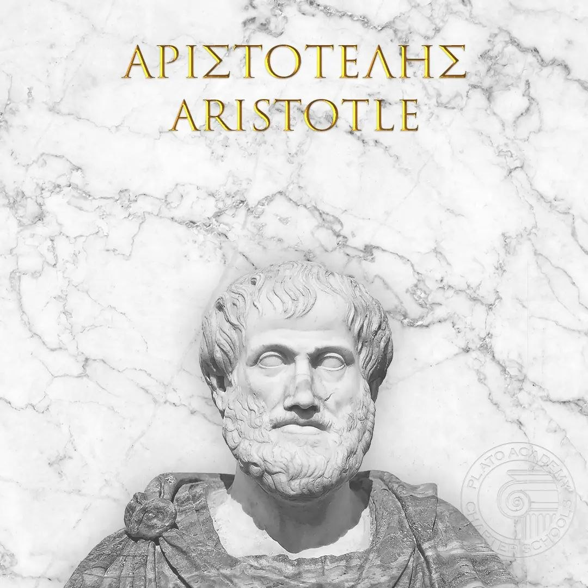

# Aristotle Syllogism Reasoner

An interactive Codex/Cursor skill for building and testing Aristotelian categorical syllogisms.

The skill guides a user through a structured reasoning process: collect a major premise, collect a minor premise, ask whether to test or infer a conclusion, convert the argument into standard categorical form, identify the logical terms, and test deductive validity with Venn-style reasoning.

## What This Skill Does

`aristotle-syllogism-reasoner` helps analyze short categorical arguments such as:

```text
All humans are mortal.
Socrates is human.
Therefore, Socrates is mortal.
```

It focuses on logical validity: whether the conclusion must follow from the premises. It does not judge whether the premises are true in the real world unless the user explicitly asks for factual evaluation.

The skill is useful for:

- Learning the structure of Aristotelian syllogisms
- Converting ordinary statements into categorical form
- Identifying major, minor, and middle terms
- Testing whether a proposed conclusion follows deductively
- Producing counterexamples for invalid arguments

## Aristotelian Categorical Syllogisms

An Aristotelian categorical syllogism is a deductive argument made from two categorical premises and one categorical conclusion. Each statement relates one class or category to another.

A standard syllogism has three terms:

- **S**: the minor term, or subject of the conclusion
- **P**: the major term, or predicate of the conclusion
- **M**: the middle term, which appears in both premises but not in the conclusion

The classic standard layout is:

```text
Major premise:     M - P
Minor premise:     S - M
Conclusion:        S - P
```

Example:

```text
All humans are mortal.
All philosophers are humans.
Therefore, all philosophers are mortal.
```

Here, `philosophers` is S, `mortal` is P, and `humans` is M.

## Supported Categorical Forms

The skill supports the four traditional categorical proposition forms:

| Code | Name | Pattern |
| --- | --- | --- |
| A | Universal affirmative | All A are B. |
| E | Universal negative | No A are B. |
| I | Particular affirmative | Some A are B. |
| O | Particular negative | Some A are not B. |

When a user provides ordinary language, the skill normalizes it into one of these forms before analysis. If the wording is ambiguous, the skill asks a clarifying question instead of guessing.

## Reasoning Workflow

The skill proceeds one step at a time:

1. **Ask for the major premise**
   The major premise is the general rule, usually connecting the middle term to the major term.

2. **Ask for the minor premise**
   The minor premise is the specific case, usually connecting the minor term to the middle term.

3. **Ask about the conclusion**
   The user can provide a conclusion to test, or ask the skill to infer the strongest supported categorical conclusion.

4. **Convert statements to categorical form**
   Each premise and conclusion is rewritten as one of the A, E, I, or O forms.

5. **Identify terms**
   The skill identifies S, M, and P, then arranges the argument into standard order if needed.

6. **Test validity**
   The skill checks whether it is impossible for both premises to be true while the conclusion is false.

7. **Explain the result**
   The final answer includes the premises, conclusion, validity result, term mapping, categorical mood, and a short explanation.

## Major Premise, Minor Premise, and Terms

The skill distinguishes between statement roles and term roles:

| Item | Meaning |
| --- | --- |
| Major premise | The premise containing P and M |
| Minor premise | The premise containing S and M |
| Conclusion | The claim relating S to P |
| S | Minor term; subject of the conclusion |
| P | Major term; predicate of the conclusion |
| M | Middle term; appears in both premises, not in the conclusion |

For example:

```text
Major premise: All mammals are animals.
Minor premise: All cats are mammals.
Conclusion: All cats are animals.
```

The term mapping is:

- S = cats
- M = mammals
- P = animals

The categorical mood is `AAA-1`, traditionally called Barbara.

## Testing Deductive Validity

The skill treats validity as a formal property:

> A syllogism is valid if there is no possible case where both premises are true and the conclusion is false.

This means an argument can be valid even if a premise is factually false. Validity only concerns whether the conclusion follows from the premises.

The skill recognizes common valid patterns, including:

```text
All M are P.   All S are M.   Therefore, all S are P.        (Barbara)
No M are P.    All S are M.   Therefore, no S are P.         (Celarent)
Some S are M.  All M are P.   Therefore, some S are P.       (Darii)
Some S are M.  No M are P.    Therefore, some S are not P.   (Ferio)
```

It also flags common invalid patterns such as undistributed middle terms:

```text
All A are B.
Some C are B.
Therefore, some C are A.
```

In that form, A and C are both connected to B, but they are not necessarily connected to each other.

## Venn-Style Counterexamples

For invalid arguments, the skill uses Venn-style set reasoning:

- Model S, M, and P as overlapping circles.
- Shade impossible regions for universal negative statements.
- Place existence markers for particular statements.
- Check whether the conclusion must be true in every diagram that satisfies the premises.
- If not, construct a concrete counterexample.

Example invalid argument:

```text
All cats are mammals.
Some dogs are mammals.
Therefore, some dogs are cats.
```

Counterexample:

```text
Let cats and dogs be separate groups inside mammals.
All cats are mammals: true.
Some dogs are mammals: true.
Some dogs are cats: false.
```

The premises can be true while the conclusion is false, so the argument is invalid.

## Examples

### Valid Syllogism

Input:

```text
Major premise: All humans are mortal.
Minor premise: Socrates is human.
Conclusion: Therefore, Socrates is mortal.
```

Expected output:

```text
Major Premise:
All humans are mortal.

Minor Premise:
All Socrates are humans.

Conclusion:
All Socrates are mortal.

Validity: Valid

Explanation:
S = Socrates, M = humans, P = mortal beings. The form is AAA-1, also called Barbara. If every human is mortal and Socrates is within the class of humans, then Socrates must be within the class of mortal beings. No counterexample is possible while both premises remain true.
```

### Invalid Syllogism

Input:

```text
Major premise: All cats are mammals.
Minor premise: Some dogs are mammals.
Conclusion: Therefore, some dogs are cats.
```

Expected output:

```text
Major Premise:
All cats are mammals.

Minor Premise:
Some dogs are mammals.

Conclusion:
Some dogs are cats.

Validity: Invalid

Explanation:
S = dogs, M = mammals, P = cats. The form is AII-2. This has an undistributed middle: both cats and some dogs are placed inside mammals, but nothing requires dogs and cats to overlap. A counterexample is a world where cats and dogs are separate groups of mammals.
```

### Valid Negative Syllogism

Input:

```text
Major premise: No reptiles are mammals.
Minor premise: All snakes are reptiles.
Conclusion: Therefore, no snakes are mammals.
```

Expected output:

```text
Major Premise:
No reptiles are mammals.

Minor Premise:
All snakes are reptiles.

Conclusion:
No snakes are mammals.

Validity: Valid

Explanation:
S = snakes, M = reptiles, P = mammals. The form is EAE-1, also called Celarent. The overlap between reptiles and mammals is excluded; since all snakes are inside reptiles, no snake can be inside mammals.
```

## Folder Structure

```text
aristotle-syllogism-reasoner/
|-- README.md
`-- skills/
    `-- aristotle-syllogism-reasoner/
        `-- SKILL.md
```

`SKILL.md` contains the complete skill definition, including triggers, workflow, categorical forms, valid and invalid patterns, and required output format.

## How to Use

Use the skill by invoking it in an environment that supports Codex/Cursor skills:

```text
$aristotle-syllogism-reasoner
```

Then follow the prompts:

```text
What is your major premise: the general rule?
What is your minor premise: the specific case?
Do you want to provide a conclusion to test, or should I infer the conclusion automatically?
```

You can also provide all statements at once. If the role of each statement is unclear, the skill will ask for confirmation before analyzing the argument.

## Output Format

The skill returns results in this structure:

```text
Major Premise:
Minor Premise:
Conclusion:
Validity: Valid / Invalid
Explanation:
Corrected Conclusion:
```

`Corrected Conclusion` is included only when a supplied conclusion is invalid but a different valid conclusion follows, or when a stronger or weaker categorical conclusion is the correct inference.

## License

No license file is currently included in this repository. Before distributing or publishing the skill, add a dedicated `LICENSE` file at the repository root and update this section with the selected license.
